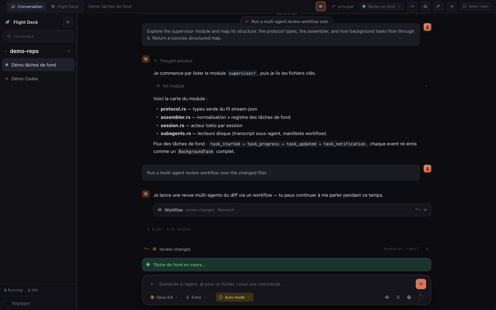
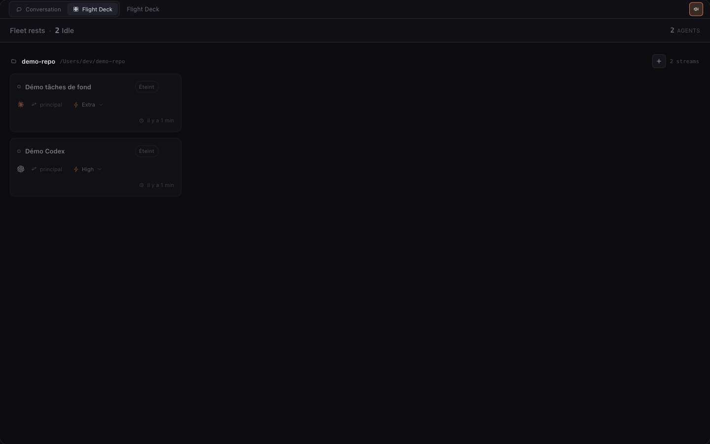
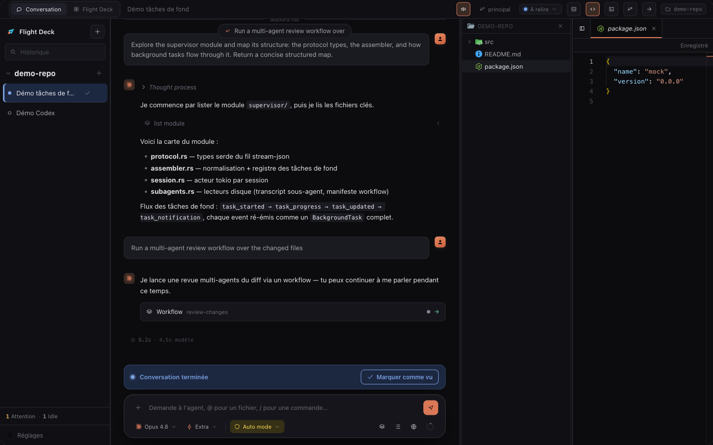

<div align="center">


# Flight Deck

**A fast, native desktop cockpit for piloting Claude&nbsp;Code and Codex —**
**with many agents running in parallel, in one clean tool.**

[](#-getting-started) [](https://tauri.app) [](https://www.rust-lang.org) [](https://react.dev) [](https://www.typescriptlang.org) [](CHANGELOG.md) [](#-roadmap)

</div>

<div align="center">

</div>

> [!NOTE]
> **Flight Deck** is the product name. `tosse-code` is the repository and technical
> identity (bundle id `com.tosse.desktop`, Rust crate, CRM project) — the two differ
> on purpose. The UI currently ships in French; the screenshots reflect the current build.

---

## Table of contents

- [What is Flight Deck?](#-what-is-flight-deck)
- [Why it exists](#-why-it-exists)
- [Features](#-features)
- [A quick tour](#-a-quick-tour)
- [Architecture](#-architecture)
- [Tech stack](#-tech-stack)
- [Getting started](#-getting-started)
- [Project layout](#-project-layout)
- [Development](#-development)
- [Releases &amp; auto-update](#-releases--auto-update)
- [Contributing](#-contributing)
- [Roadmap](#-roadmap)
- [License](#-license)

---

## 🛰 What is Flight Deck?

Flight Deck is an internal desktop app that runs [Claude Code](https://www.anthropic.com/claude-code)
the way our team actually works. Today you can use Claude Code either in a terminal
or in the Claude Code app — but neither is optimized for **watching and steering
several agents at once**. Flight Deck is the single tool that combines:

- a **clean, VS Code-inspired conversation** with each agent,
- a **lightweight integrated code editor** and **terminal**, and
- a **Flight Deck view** that oversees a whole fleet of agents working in parallel.

It drives the official `claude` binary over its stream-json protocol — and, as a second
backend, the `codex` CLI from OpenAI — so it keeps your **Claude Max** and **ChatGPT**
plans instead of paying per API token.

Performance is a **core, non-negotiable principle**: no embedded Chromium, a native Rust
core, and a "dumb" UI that only renders already-normalized events.

---

## 💡 Why it exists

| | Terminal `claude` | Claude Code app | **Flight Deck** |
|---|:---:|:---:|:---:|
| Clean, structured conversation | ~ | ✅ | ✅ |
| Integrated editor + terminal | — | ~ | ✅ |
| **Many agents at a glance** | — | — | ✅ |
| Git worktrees per agent | manual | — | ✅ |
| Background tasks & workflows surfaced | — | — | ✅ |
| Claude **and** Codex, one UI | — | — | ✅ |
| Keeps the Max / plan subscription | ✅ | ✅ | ✅ |

---

## ✨ Features

### 🎛 Flight Deck — the fleet view

The flagship view. Every conversation across every repository becomes a live card in a
per-repo swimlane, showing each agent's state (running, needs attention, reviewing, idle)
at a glance. A **fleet readout** tallies the whole fleet, OS notifications + a chime + a
Dock bounce alert you when an agent finishes or needs input, and cards are fully
interactive — adjust effort, inspect context usage, read the to-do stack, reply in a
modal, or delete a conversation, all without leaving the deck.

### 💬 Clean conversation

A conversation UI modeled on the official Claude Code VS Code extension: grouped tool
steps, collapsible thinking blocks, three Markdown rendering modes, syntax highlighting,
inline image previews for screenshots the agent reads, and per-turn / per-tool duration
readouts. **Clean output** folds intermediate work per round; **rewind & fork** let you
resume from any message or branch off into a new conversation. Attach files and images to
a message with the composer's `+` button or a paste.

### ✏️ Integrated editor

A lazy-loaded [Monaco](https://microsoft.github.io/monaco-editor/) editor in a side panel,
rooted on the agent's live working directory (it follows worktree moves). File tree with a
live filesystem watch, syntax highlighting, clickable file mentions, a built-in **PDF
viewer** (zoom, fit-to-width) and **image viewer** — all code-split so they never touch
app startup.

### ⌨️ Integrated terminal

A real PTY, exposed through [xterm.js](https://xtermjs.org) with WebGL rendering. Terminal
instances are **persistent per conversation** (they survive panel toggles and conversation
switches) and are torn down without leaving orphan processes.

### 🌿 Git & worktrees

First-class git worktrees: the agent's native `EnterWorktree` / `ExitWorktree` tools are
intercepted to keep the editor, watch and terminal in sync, with a worktree manager modal
and a sidebar badge for the active worktree.

### 🤖 Dual backend — Claude Code + Codex

One normalized conversation model, **two producers**. Claude Code and OpenAI's Codex
(`codex app-server`) run side by side with the same UI: fleet, badges, history panel,
remote control, usage ring. The backend is chosen when a conversation is created.

### 🛠 Background tasks & workflows

Background agents, `Bash`/`Monitor` tasks and multi-agent **Workflows** get pinned bars
above the composer with live tail, stop controls, and a detailed workflow view (phases,
journal, per-agent transcripts). An agent that finishes while a background task is still
running is clearly shown as "background task in progress" rather than a misleading "review"
state.

### 📡 Remote control

Flip a switch to bridge a conversation to `claude.ai/code` and the mobile app over the
stream-json control channel — messages from your phone or the web sync straight back into
the thread.

### 🧩 Extensions & slash commands

A manager for **skills, plugins and MCP servers** (per scope, with live status and hot
reload of a running session), plus a `/` slash-command menu in the composer, grouped by
scope and refreshed after a reload.

### ⚙️ Settings, shortcuts & auto-update

A tabbed settings page (General / Conversation / Shortcuts / Notifications / Updates /
Data), a keyboard-shortcut registry that doubles as its own documentation, a plan-usage
ring (5-hour & weekly windows), and a **signed auto-updater** that checks on launch and
every two hours.

---

## 📸 A quick tour

<table>
  <tr>
    <td width="50%" valign="top">
      <br/>
      <sub><b>Flight Deck</b> — every agent, every repo, one glance.</sub>
    </td>
    <td width="50%" valign="top">
      <br/>
      <sub><b>Split view</b> — conversation on the left, integrated Monaco editor on the right.</sub>
    </td>
  </tr>
</table>

---

## 🏗 Architecture

Flight Deck is three layers: a React UI, a Rust core, and one `claude` (or `codex`) child
process per session.

```
┌──────────────────────────────────────────────────────────┐
│  React + TypeScript UI  (rendered in the OS webview)       │
│  Flight Deck · Conversation · Editor · Terminal · Git      │
└───────────────▲───────────────────────────┬───────────────┘
                │  typed IPC (tauri-specta)  │  normalized events
┌───────────────┴───────────────────────────▼───────────────┐
│  Rust core (Tauri 2 + tokio)                               │
│  supervisor · git · fs · terminal · usage · store (SQLite) │
└───────────────▲───────────────────────────┬───────────────┘
                │  stream-json over stdio    │  control channel
┌───────────────┴───────────────────────────▼───────────────┐
│  claude  ×N        │        codex app-server  ×N            │
│  (official CLIs, driven as black boxes — never forked)     │
└────────────────────────────────────────────────────────────┘
```

Design principles:

- **Clean-room protocol client.** The Claude Code stream-json protocol is reimplemented in
  Rust from the dissected official VS Code extension — never a fork. A single persistent,
  bidirectional process lives for the whole session (not one-shot `claude -p`), which keeps
  the Max subscription and every future CLI improvement. Spec: [`docs/claude-code-protocol.md`](docs/claude-code-protocol.md).
- **Normalize in Rust, keep the UI dumb.** Every message is normalized in Rust; the UI never
  reconstructs protocol state.
- **One module per resource.** `store` (SQLite), `git`, `fs`, `terminal`, `usage` are each the
  sole gateway to their resource — swappable without touching the IPC or the frontend.
- **Typed IPC.** The Rust→TS contract is generated by [`tauri-specta`](https://github.com/specta-rs/tauri-specta)
  (`src/ipc/bindings.ts`), never hand-synced.
- **Metadata-only persistence.** Only repos, conversations and the active selection are stored
  in SQLite; messages stay in Claude's on-disk transcripts.

---

## 🧰 Tech stack

| Layer | Choice |
|---|---|
| Desktop shell | **Tauri 2** — the OS webview, no embedded Chromium |
| Core | **Rust** + **tokio** — process supervisor, protocol client, persistence |
| UI | **React 18** + **TypeScript** + **Vite** |
| Editor | **Monaco** (lazy-loaded, code-split) |
| Terminal | **xterm.js** + WebGL, native PTY via `portable-pty` |
| PDF | **pdf.js** (`pdfjs-dist`), lazy-loaded |
| State | **Zustand** (fleet) + **TanStack Query** (commands) |
| Persistence | **SQLite** via `rusqlite` (bundled, WAL) |
| IPC contract | **tauri-specta** (typed Rust ↔ TS) |
| Backends | official **`claude`** CLI · **`codex app-server`** |

---

## 🚀 Getting started

> Flight Deck targets **macOS** (the release bundle is a universal Apple Silicon + Intel app).

### Prerequisites

- **macOS**
- **Rust** (stable toolchain) — <https://rustup.rs>
- **Node.js ≥ 22** and **pnpm ≥ 9** (the repo pins `pnpm@11.7.0`)
- The **`claude`** CLI on your `PATH` — Flight Deck drives it. See
  [Claude Code](https://www.anthropic.com/claude-code).
- *(optional)* The **`codex`** CLI on your `PATH` to use the Codex backend.

### Install

```bash
git clone https://github.com/Alex375/tosse-code.git
cd tosse-code
pnpm install
```

### Run in development

```bash
pnpm tauri dev
```

This launches the Rust core and the Vite dev server together, in a native window with
hot-reload.

### Build a release bundle

```bash
pnpm tauri build
```

The bundle is written under `src-tauri/target/release/bundle/`.

> [!TIP]
> `tauri dev` and `tauri build` reuse the production bundle identifier, which shares the
> production SQLite database. To test a build without touching your real data, give it a
> distinct name and identifier (the repo's internal `/build-app` and `/build-dev` workflows
> automate this).

---

## 📁 Project layout

A pnpm monorepo — Rust core and React frontend side by side.

```
tosse-code/
├─ src/                     # React + TypeScript frontend
│  ├─ features/             # flightdeck · conversation · editor · terminal · git ·
│  │                        #   explorer · extensions · settings · history
│  ├─ agent/                # agent status, fleet ordering, permission classification
│  ├─ store/                # Zustand stores (conversations, background tasks, …)
│  ├─ ipc/                  # typed bindings + browser mock harness
│  ├─ notifications/        # OS notify, chime, state-transition detection
│  └─ ui/                   # shared UI kit, shortcuts, conductor design
├─ src-tauri/               # Rust core (Tauri 2)
│  └─ src/
│     ├─ supervisor/        # protocol client, assembler, per-session actor, codex/
│     ├─ git/               # the only git gateway (wraps the git CLI)
│     ├─ fs/                # the only editor filesystem service
│     ├─ terminal/          # the only PTY service
│     ├─ usage/             # OAuth credentials + plan-usage endpoint
│     └─ store/             # SQLite records + migrations
├─ docs/                    # protocol spec, media
└─ scripts/                 # version bump, file-icon generation
```

---

## 🧑‍💻 Development

| Task | Command |
|---|---|
| Frontend typecheck | `pnpm typecheck` |
| Frontend unit tests | `pnpm test` *(vitest)* |
| Rust unit tests | `cd src-tauri && cargo test --lib` |
| Rust live tests *(spawns real `claude`/`codex`)* | `cd src-tauri && cargo test --lib -- --ignored --nocapture` |
| Typecheck + build the frontend | `pnpm build` |
| Regenerate the typed IPC bindings | `cd src-tauri && cargo test --lib export_bindings_regenerates_ts_client` |

**CI** ([`.github/workflows/ci.yml`](.github/workflows/ci.yml)) runs vitest, `cargo test`
and a frontend build on every pull request to `main`.

> The generated IPC bindings (`src/ipc/bindings.ts`) are **committed on purpose** — regenerate
> and commit them before opening a PR; the release build does not regenerate them.

---

## 📦 Releases &amp; auto-update

- **Versioning:** SemVer, kept in sync across `tauri.conf.json`, `package.json` and
  `Cargo.toml` via `pnpm bump <patch|minor|major|X.Y.Z>` — never edited by hand.
- **Releases** are cut manually from `main` via a GitHub Actions workflow that produces a
  signed, universal macOS bundle (`.dmg` + updater artifacts).
- **Auto-update:** the app checks for updates on launch and every two hours, verifies a
  cryptographic signature on each artifact, and relaunches. User data (SQLite + transcripts)
  lives outside the bundle and is preserved across updates.
- Per-version, user-facing notes live in [`CHANGELOG.md`](CHANGELOG.md) and are shown in-app
  on update.

---

## 🤝 Contributing

- **`main`** is protected — everything lands through a pull request that passes CI and is
  approved by the code owner.
- **`dev`** is the shared working branch. Feature work happens in a dedicated git worktree
  off `dev`, then merges back to `dev`, then a `dev → main` PR ships it.
- Never `git push origin main` directly.

Write all code comments and identifiers in **English**; never commit secrets or API keys.

---

## 🗺 Roadmap

Planned, not yet shipped:

- **MCP server to pilot the IDE** — expose every meaningful UI action as a tool so an agent
  can open a file at the right line, open a diff, focus an agent, switch views, and more.
- **IDE tools for the agent** — `openDiff`, `openFile`, `getCurrentSelection`,
  `getDiagnostics`, `getWorkspaceFolders`, `saveDocument`.
- **TOSSE task integration** — browse projects and tasks in-app; click a task to start an
  agent on it directly.

---

## 📄 License

Flight Deck (`tosse-code`) is **proprietary internal software** developed by **Tosse**
(Alexandre Josien &amp; Armand Mounsi). All rights reserved. It is not licensed for
redistribution.

<div align="center">
<sub>Built with 🦀 Rust + ⚛️ React on Tauri 2 · Repository managed by <a href="https://frontend-production-7e11.up.railway.app">TOSSE CRM</a></sub>
</div>
